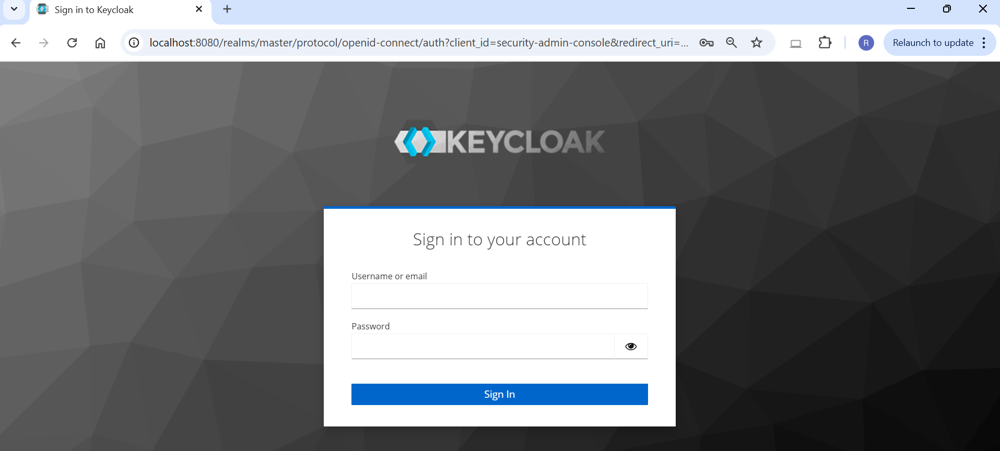
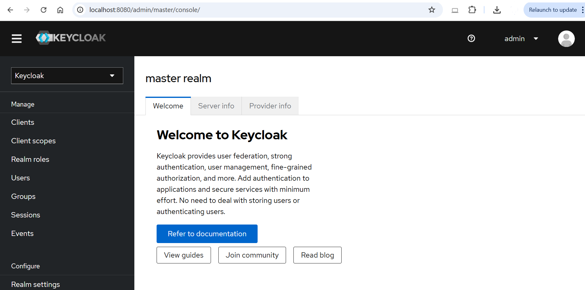
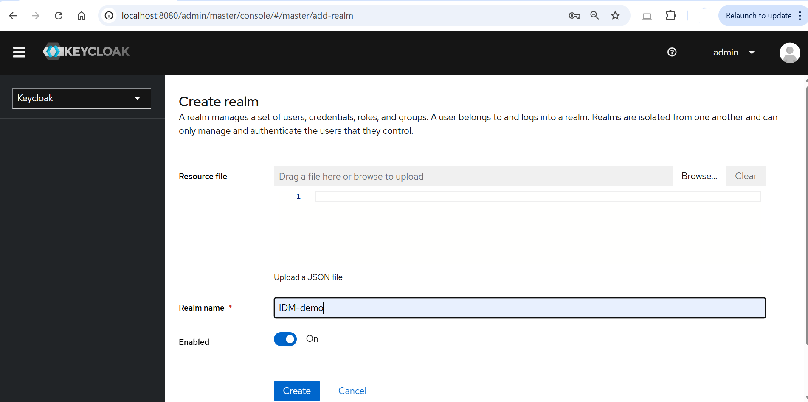
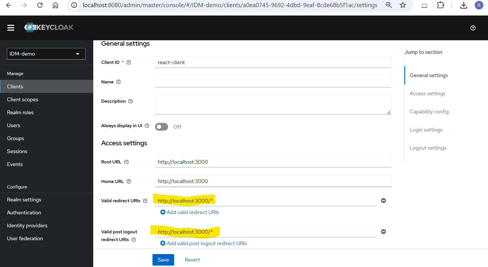
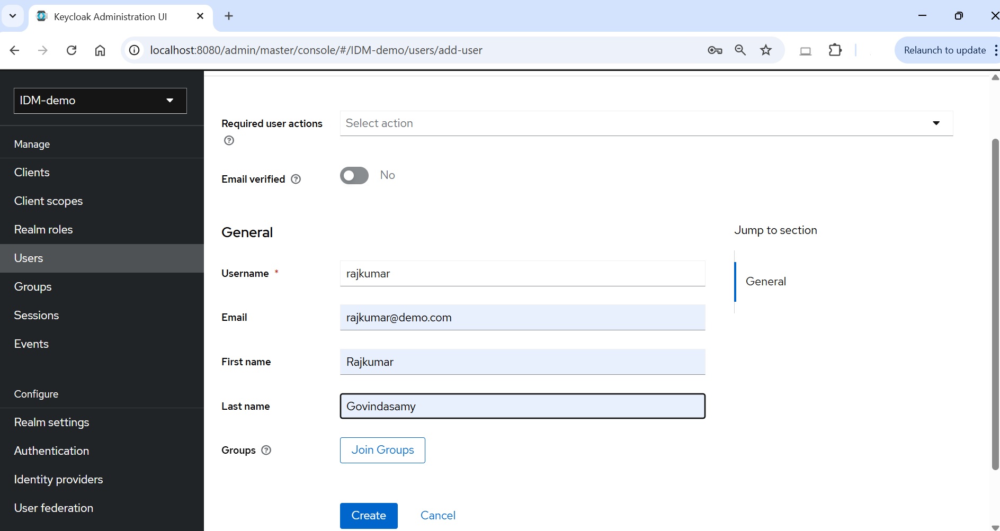
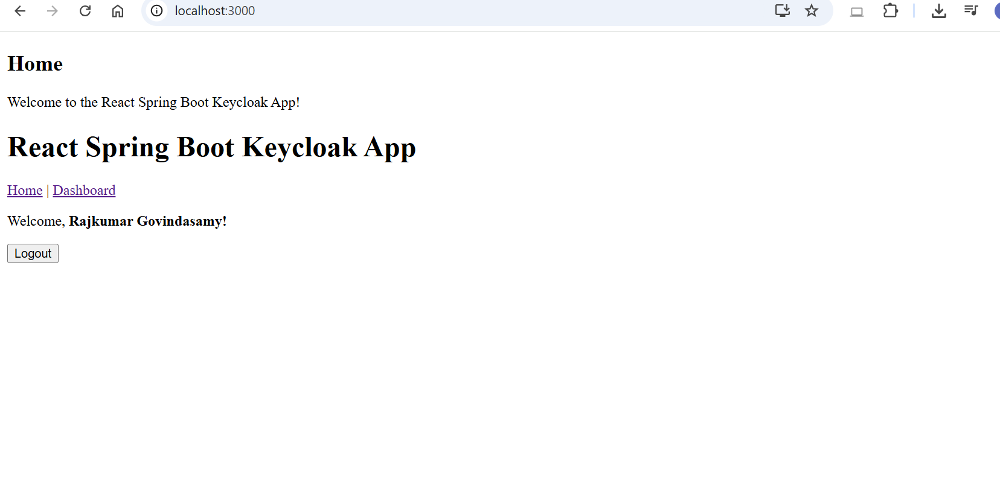
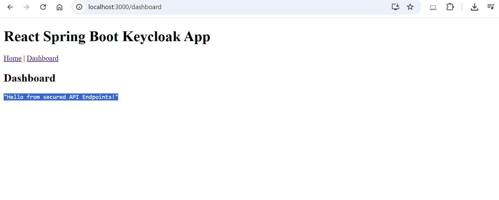
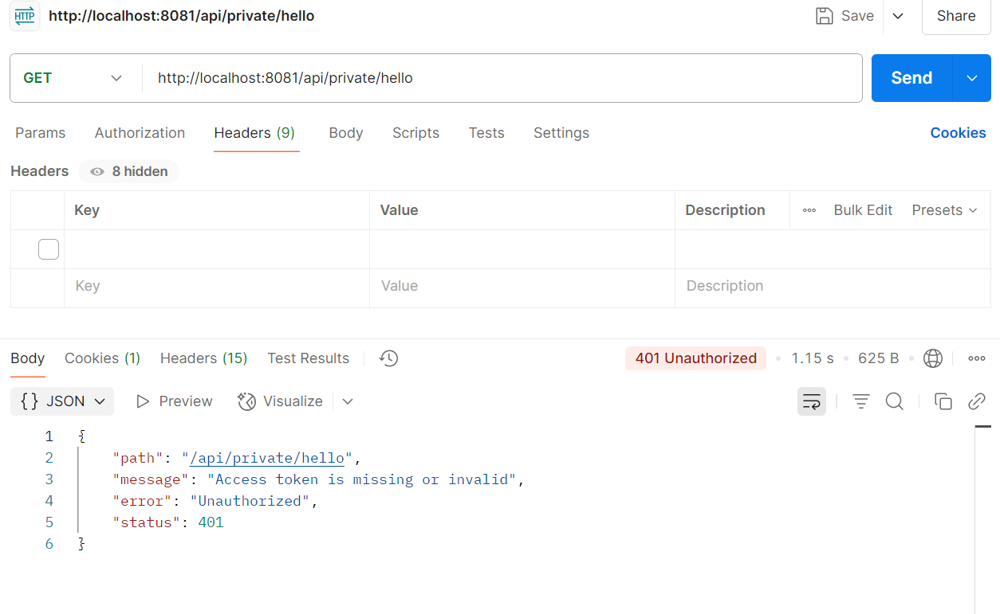
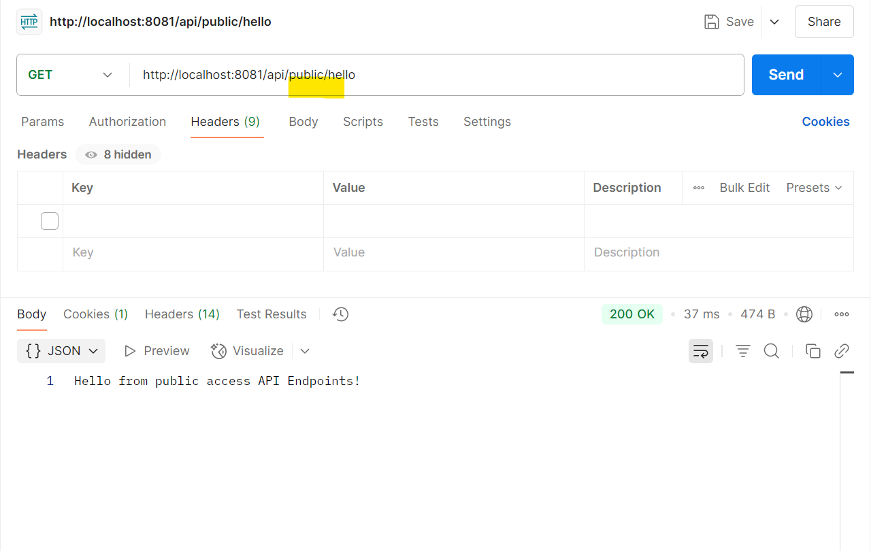

# React Spring Boot Keycloak Application

This project is a sample application that integrates React with Spring Boot and Keycloak for authentication. It consists of a backend service built with Spring Boot and a frontend application developed using React.
## Getting Started

### Clone the Repository

To get started, clone this repository:

```bash
git clone https://github.com/Rajkumardev/react-springboot-keycloak-app.git
cd react-springboot-keycloak-app
```
## Project Structure

```
react-springboot-keycloak-app
├── backend
│   ├── src
│   │   ├── main
│   │   │   ├── java
│   │   │   │   └── com
│   │   │   │       └── example
│   │   │   │           └── keycloakapp
│   │   │   │               ├── controller
│   │   │   │               │   └── HelloController.java
│   │   │   │               ├── config
│   │   │   │               │   └── SecurityConfig.java
│   │   │   │               ├── security
│   │   │   │               │   └── CustomSecurityConfig.java
│   │   │   │               └── KeycloakAppApplication.java
│   │   │   └── resources
│   │   │       ├── application.properties
│   │   │       
│   ├── target
│   ├── pom.xml
│   └── README.md
│   ├── target
│   ├── pom.xml
│   └── README.md
├── frontend
│   ├── src
│   │   ├── App.tsx
│   │   ├── index.tsx
│   │   ├── components
│   │   │   ├── Dashboard.tsx
│   │   │   └── Login.tsx
│   │   └── routes
│   │       └── AppRouter.tsx
│   ├── public
│   │   └── index.html
│   ├── package.json
│   ├── tsconfig.json
│   └── README.md
└── README.md
```

## Keycloak Setup & Launch
1. Run Keycloak locally or on Docker:
   ```
   docker run -p 8080:8080 -e KEYCLOAK_ADMIN=admin -e KEYCLOAK_ADMIN_PASSWORD=admin quay.io/keycloak/keycloak:24.0.2 start

   ```
   Bonus - MFA Setup
   https://www.youtube.com/watch?v=p_kL4W0EseM
2. To access the Keycloak server locally, open `http://localhost:8080` in your browser.
   **Login Screen:**
   

   **Dashboard Page:**
   

   **Create Realm:**
   

   **Create Client:**
   

   **Create User:**
   

## Backend Setup

1. Navigate to the `backend` directory.
2. Ensure you have Java and Maven installed.
3. Run the following command to start the Spring Boot application:
   ```
   mvn spring-boot:run
   ```
4. The backend will be available at `http://localhost:8080`.
### Keycloak Configuration

- Update the following properties in `application.properties` with your Keycloak server details, realm, and client information:

```properties
spring.security.oauth2.resourceserver.jwt.issuer-uri=http://localhost:8080/realms/your-releam
spring.security.oauth2.resourceserver.jwt.jwk-set-uri=http://localhost:8080/realms/your-releam/protocol/openid-connect/certs

```

- Make sure to replace the placeholders with your actual Keycloak configuration values.

## Frontend Setup

1. Navigate to the `frontend` directory.
2. Ensure you have Node.js and npm installed.
3. Install the dependencies by running:
   ```
   npm install
   ```
4. Start the React application with:
   ```
   npm start
   ```
5. The frontend will be available at `http://localhost:3000`.

### Keycloak Configuration
To configure Keycloak in your React frontend, update your `KeycloakService.ts` (or equivalent) with your Keycloak server details. For example:

```
typescript
const keycloak = new Keycloak({
   url: 'http://localhost:8080',
   realm: 'your-releam',
   clientId: 'your-client',
});

```

Replace the `url`, `realm`, and `clientId` values with those matching your Keycloak setup. This ensures your React app can authenticate users via Keycloak.

## Final Output
   **Front End Login Screen:** 

   

   **Home Page:**  

   

   **Dashboard Page:**  

   

   **Accessing a private API endpoint without a token:**  

   

   **Accessing a public API endpoint without a token:**  

   
## Conclusion

This project serves as a basic template for integrating React with Spring Boot and Keycloak. You can extend it further by adding more features and functionalities as per your requirements.
